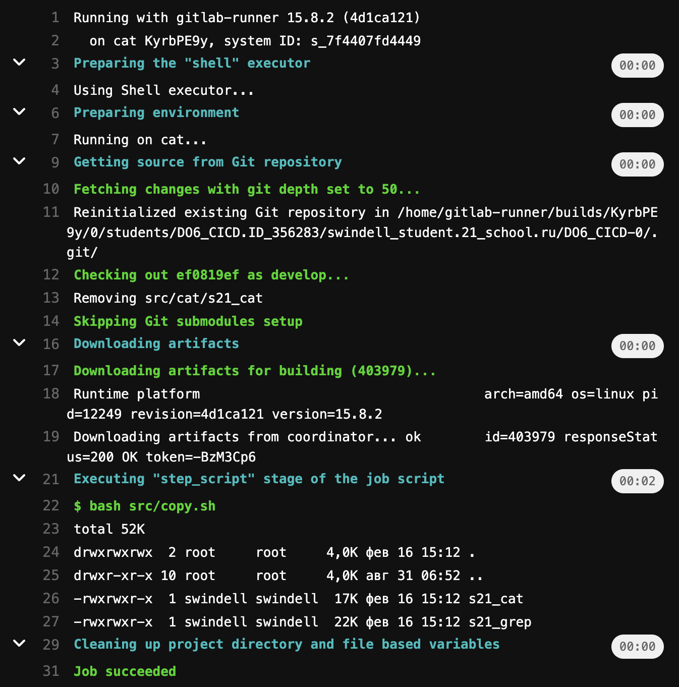

# Basic CI/CD

## Part 1. Настройка **gitlab-runner**
##### 1.1. Скачаем и установим на виртуальную машину **gitlab-runner**
Для этого выполним надоб команд:
> sudo curl -L --output /usr/local/bin/gitlab-runner "https://gitlab-runner-downloads.s3.amazonaws.com/latest/binaries/gitlab-runner-linux-amd64" \
(Настройка репозитория)

> sudo chmod +x /usr/local/bin/gitlab-runner </br>

> sudo useradd --comment 'GitLab Runner' --create-home gitlab-runner --shell /bin/bash </br>

> sudo gitlab-runner install --user=gitlab-runner --working-directory=/home/gitlab-runner </br>

> sudo gitlab-runner start

> sudo systemctl enable --now gitlab-runner </br>


    
##### 1.2. Запустим **gitlab-runner** и зарегистрируем его для использования в текущем проекте (*DO6_CICD*) командой `sudo gitlab-runner register`
- Enter the Gitlab instance URL: (берем со странички задания на платформе)
- Enter the registration token: (берем со странички задания на платформе)
- Enter a description for the runner: (skip)
- Enter tags for the runner: build,style,test,deploy,notify
- Enter optional maintenance note for the runner: (skip)
- Enter an executor: shell


Проверим, что все установилось командой  `sudo gitlab-runner verify`
Выполним команды

> sudo gitlab-runner run

> sudo rm /home/gitlab-runner/.bash_logout 

Проверим, чо все работает

> service gitlab-runner status

## Part 2. Сборка
Создадим файл .gitlab-ci.yml в папке проекта и устанавливаем все утилиты для запуска Makefile и скриптов с тестами.

##### В файле _gitlab-ci.yml_ добавим этап запуска сборки через мейк файл из проекта _C2_
##### Файлы, полученные после сборки (артефакты), сохраним в произвольную директорию со сроком хранения 30 дней.

Содержимое файла .gitlab-ci.yml \
 \
Результат сборки(building) \


## Part 3. Тест кодстайла
##### Напишем этап для **CI**, который запускает скрипт кодстайла (*clang-format*). Если кодстайл не прошел, то "зафейлим" пайплайн
##### В пайплайне отобразить вывод утилиты *clang-format*

Добавленный код в файл .gitlab-ci.yml \
 \
Результат сборки \
 \
Check_style


## Part 4. Интеграционные тесты
##### Напишем этап для **CI**, который запускает ваши интеграционные тесты из того же проекта. Запускать этот этап автоматически только при условии, если сборка и тест кодстайла прошли успешно. Если тесты не прошли, то "зафейлим" пайплайн. В пайплайне отобразим вывод, что интеграционные тесты успешно прошли / провалились.

Добавленный код в файл .gitlab-ci.yml \
 \
Результат сборки \


## Part 5. Этап деплоя
Поднимем вторую виртуальную машину *Ubuntu Server 20.04 LTS*

##### 5.1. Напишем этап для **CD**, который "разворачивает" проект на другой виртуальной машине. Запускать этот этап вручную при условии, что все предыдущие этапы прошли успешно
##### 5.2. Напишем bash-скрипт, который при помощи **ssh** и **scp** копирует файлы, полученные после сборки (артефакты), в директорию */usr/local/bin* второй виртуальной машины: src/copy.sh

На 1 машине выполним следующие команды:

> sudo su - gitlab-runner </br>

> ssh-keygen -t rsa -b 2048 </br>

> ssh-copy-id <username>@<ip_address> 
(swindell@10.10.0.20 - ip 2 машины)

На 2 машине дадим права доступа папке, в которую будем копировать:
> sudo chmod -R 777 /usr/local/bin/

##### 5.3. В файле _gitlab-ci.yml_ добавим этап запуска написанного скрипта
 \
Результат сборки(deploy) \



## Part 6. Дополнительно. Уведомления
##### Настроим уведомления о успешном/неуспешном выполнении пайплайна через бота с именем "[ваш nickname] DO6 CI/CD" в *Telegram*
Создадим бота с помощью @FatherBot. \
Создадим скрипт notify.sh для заупска бота. \
В файл _gitlab-ci.yml_ добавим запуск скрипта после каждого этапа сборки:
```
after_script:
    - sh src/notify.sh "job_name"
```
